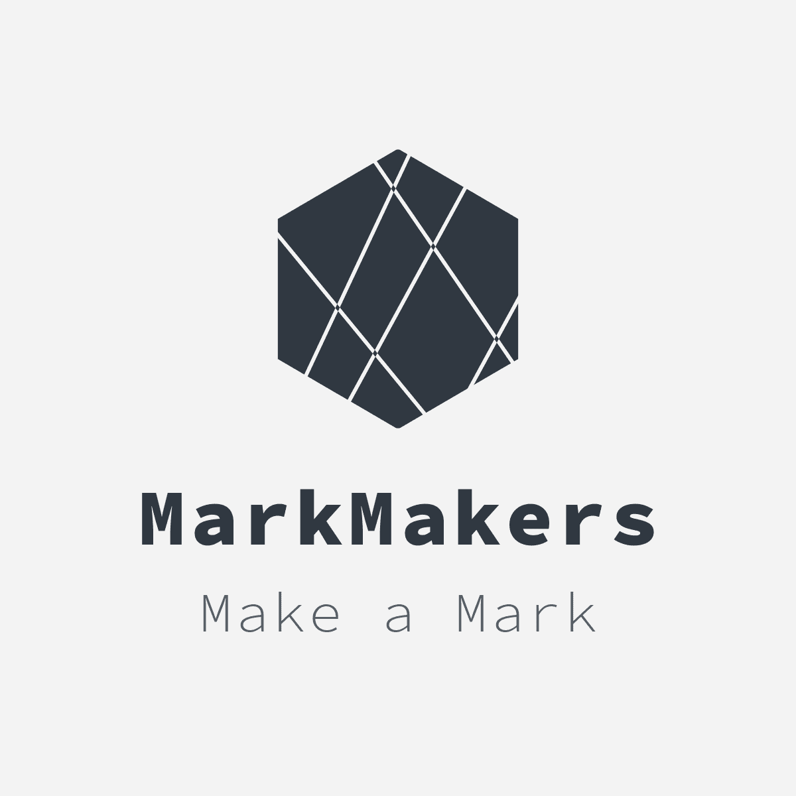

# 2020 시선 신입 MarkMakers

## MarkMakers 소개
#### 팀명: MarkMakers
     '한 획을 긋는 사람들' 이라는 뜻에서
     'MarkMakers'로 팀명을 지었습니다.  
     '시선 학회에 한 획을 그어 보자!'라는 포부를 담았습니다.

#### 팀원 소개
* 이요한(한동대 18학번 전자전산)
* 박규경(한동대 17학번 컴공심화)
* 오규찬(한동대 17학번 컴공심화)

## 프로젝트
 1. [BeMySonJu(~2.1)](./BeMySonju.md)
 2. [듣는 편지(2.2 ~ )](./ListeningLetter.md)
