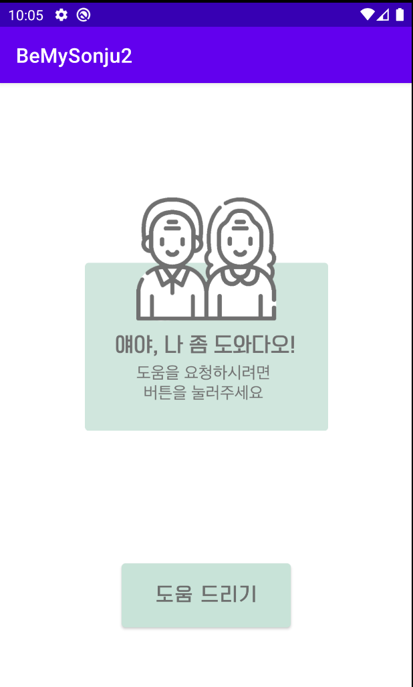
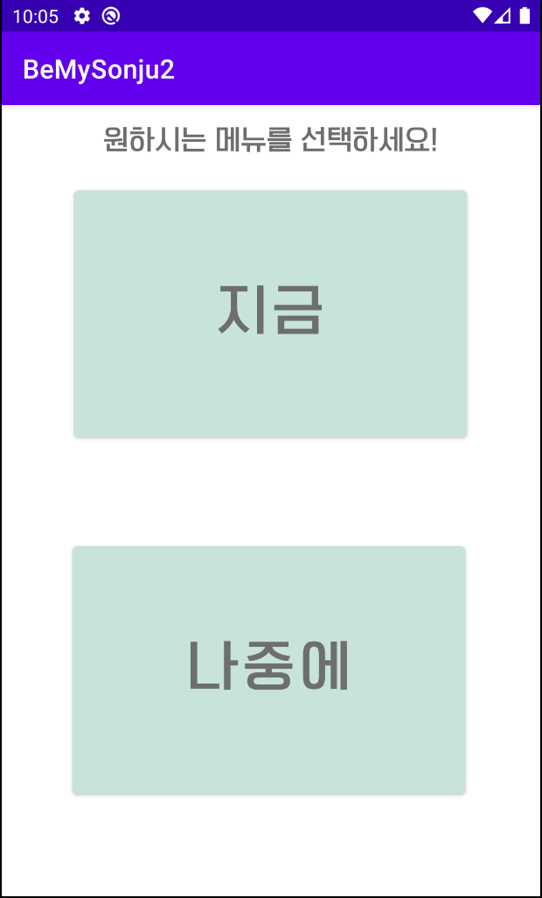
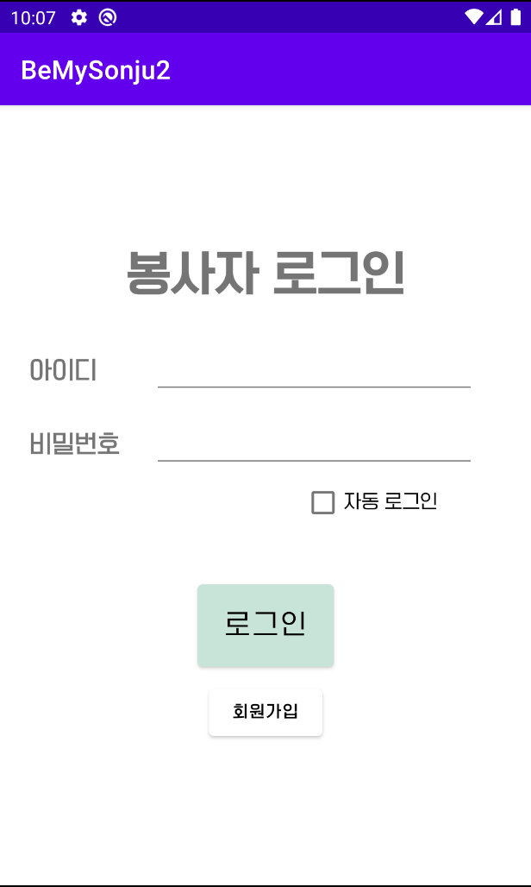
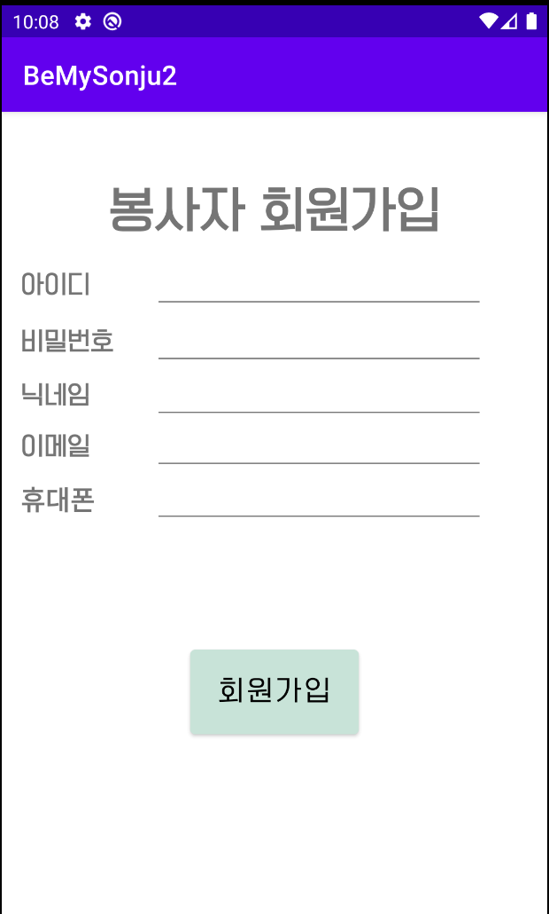
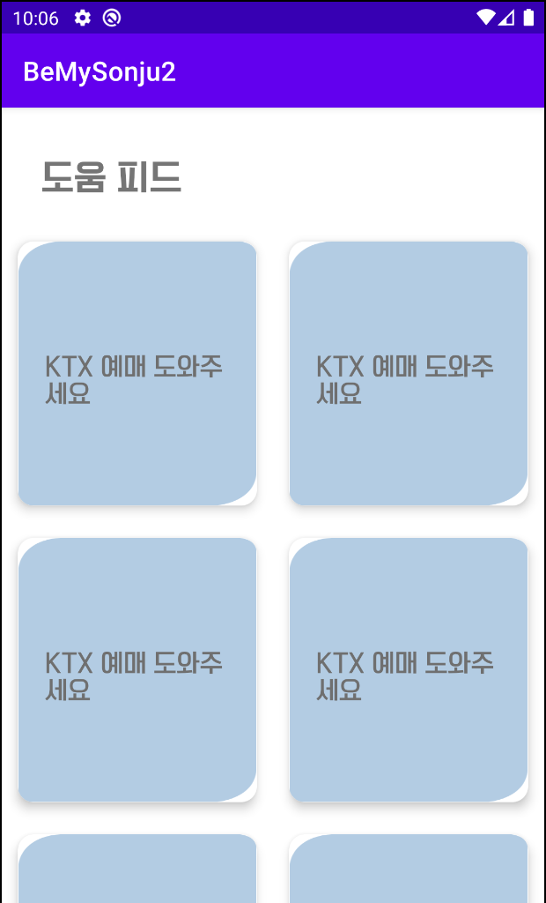
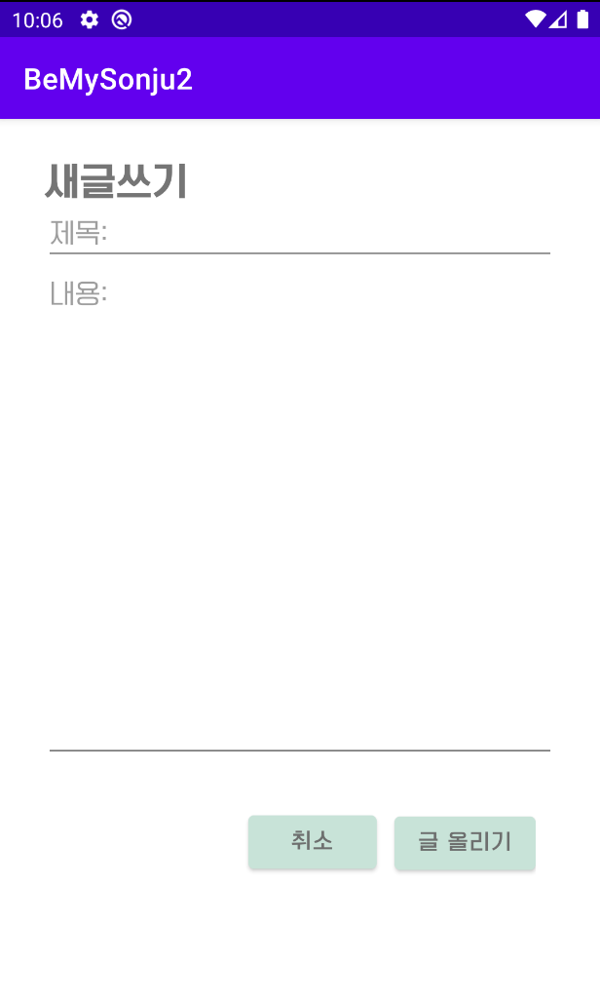
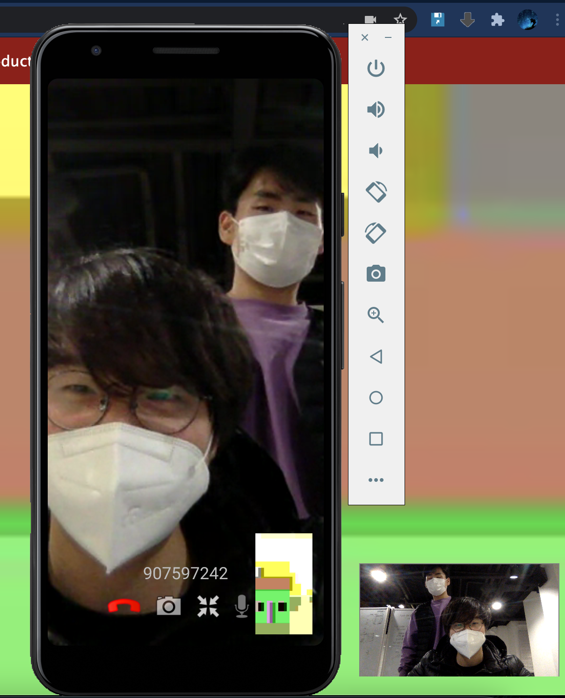

# BeMySonju
## 2020 시선 신입 MarkMakers

## MarkMakers 소개
#### 팀명: MarkMakers
     '한 획을 긋는 사람들' 이라는 뜻에서
     'MarkMakers'로 팀명을 지었습니다.  
     '시선 학회에 한 획을 그어 보자!'라는 포부를 담았습니다.

#### 팀원 소개
* 이요한(18학번 전자전산)
* 박규경(17학번 컴공심화)
* 오규찬(17학번 컴공심화)

# 능력부족으로 프로젝트 개발 보류....
## 프로젝트 소개
#### [Be My 손주](https://github.com/Ohgyuchan/BeMySonju.git):WebRTC, AppRTC를 이용한 실시간 카메라 공유 어플리케이션
#### 문제 상황 배경
> 60대를 시작으로 하여서 대부분의 고연령층에게 온라인은 익숙치 않은 것이 현실이고,  현재 포스트코로나 시대를 맞이하게 되면서 고연령층의 이러한 디지털 소외의 체감은 더욱 크게 느껴지게 되었습니다.  
> 고연령층은 대부분 경제력을 잃게 된 나이대이기 때문에 이러한 디지털 소외는 그들에게 더 큰 상실감을 주는 요소가 될 수 있기에 이를 해결하고자 이 프로젝트를 기획했습니다.  

#### 효과
1. 디지털 소외 해소
2. 세대차이 극복
3. 디지털 서비스 활용을 통한 고연령층의 생활 편의성 확대

## 기능소개
#### 주요 기능
    로그인, 도움피드, 영상통화, 화면 공유
#### 프로토타입
##### 1. 앱 시작화면  

##### 2. 유저메인  

##### 3. 봉사자 로그인  

##### 4. 회원가입  

##### 5. 도움 피드  

##### 6. 도움 피드 글쓰기 및 보기  

##### 7. 영상통화 하기  

## 개발 일정 (2.1 이후)

#### 완료사항
  1. AppRTC API 적용해보기 (완료)
  2. 기초 UI
>   (1) 앱 시작화면  
>   (2) 로그인 화면  
>   (3) 게시판 피드 화면  
>   (4) 앱 메인 화면  
#### 기능별 예정사항 (2.1 이후)
##### 1. 회원 DB, 로그인, 회원가입 기능(~2.5)
##### 2. 게시판 기능, DB 연결(~2.7)
##### 3. 앱 내 유저 간 영상통화(~2.9)
##### 4. 화면 공유 (~ 2.13)
